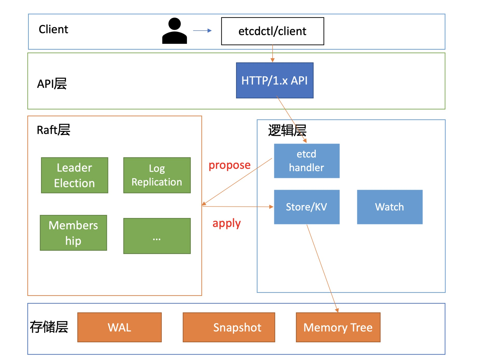
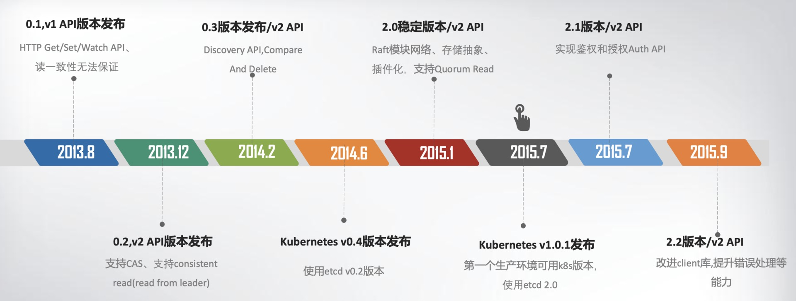
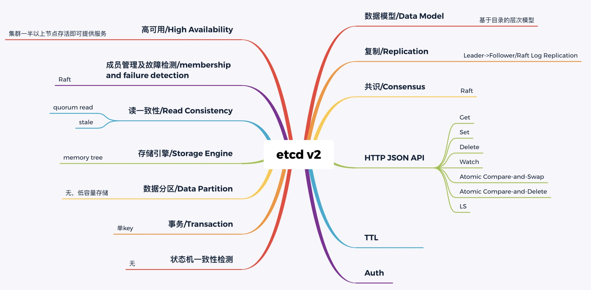
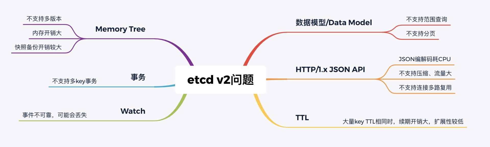
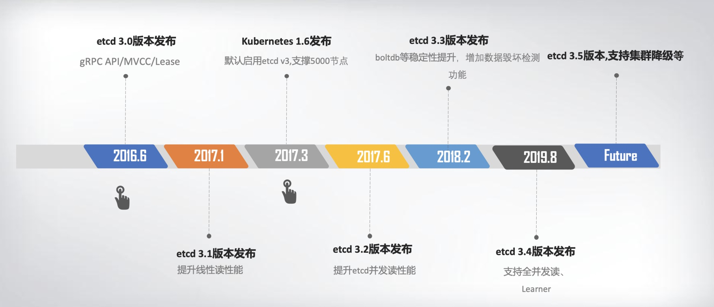

1、etcd名字由来，是linux下的/etc目录，加上d(istribute)，即分布式的配置系统。

2、etcd由coreos内部孵化而来。需要etcd的原因：

> 需要做分布式的容器化操作系统（container linux)，侧重自动化、快速部署应用，集群化管理

> 在这种诉求下，要存储配置信息、提供分布式锁等，理想状态下的一个解决方案要包含的内容有：
- 高可用
- 一致性
- 容量：低容量、仅存储元数据配置。与用户无关的数据，不需要考虑太复杂的数据分片。
- api功能：增删改查、watch、ttl等，给客户端足够的功能，同时保障服务数据的协调一致。
- 可维护性

> 当时的zoookeeper可满足：可用性、一致性、api功能。但是不支持api修改配置；同时是java写的，部署繁琐，内存过多；rpc是jute，自己实现的rpc api，无法使用curl工具，coreos需要的http+json。

3、etcd版本发展

> etcd v0.1版本架构

> etcd v1/v2关键特性

4、为什么k8s选用etcd

> 首先，etcd 高可用、Watch 机制、CAS、TTL 等特性正是 Kubernetes 所需要的

**比如**：当你使用 Kubernetes 声明式 API 部署服务的时候，Kubernetes 的控制器通过 etcd Watch 机制，会实时监听资源变化事件，对比实际状态与期望状态是否一致，并采取协调动作使其一致。Kubernetes 更新数据的时候，通过 CAS 机制保证并发场景下的原子更新，并通过对 key 设置 TTL 来存储 Event 事件，提升 Kubernetes 集群的可观测性，基于 TTL 特性，Event 事件 key 到期后可自动删除。

> coreos是k8s容器生态圈的核心成员之一

docker兴盛之后，强势控制社区，强化paas平台功能，与coreos核心商业违背，损害了google、redhat利益。

5、etcd v2核心技术点

无论是 NoSQL 存储还是 SQL 存储、文档存储，其实大家要解决的问题都是类似的，基本就是图中总结的数据模型、复制、共识算法、API、事务、一致性、成员故障检测等方面。

---- 

6、etcd v2的问题

> 首先是功能局限性问题。

它主要是指 etcd v2 不支持范围和分页查询、不支持多 key 事务。第一，etcd v2 不支持范围查询和分页。分页对于数据较多的场景是必不可少的。在 Kubernetes 中，在集群规模增大后，Pod、Event 等资源可能会出现数千个以上，但是 etcd v2 不支持分页，不支持范围查询，大包等 expensive request 会导致严重的性能乃至雪崩问题。第二，etcd v2 不支持多 key 事务。在实际转账等业务场景中，往往我们需要在一个事务中同时更新多个 key。

> 然后是 Watch 机制可靠性问题。

Kubernetes 项目严重依赖 etcd Watch 机制，然而 etcd v2 是内存型、不支持保存 key 历史版本的数据库，只在内存中使用滑动窗口保存了最近的 1000 条变更事件，当 etcd server 写请求较多、网络波动时等场景，很容易出现事件丢失问题，进而又触发 client 数据全量拉取，产生大量 expensive request，甚至导致 etcd 雪崩。

> 其次是性能瓶颈问题。

- etcd v2 早期使用了简单、易调试的 HTTP/1.x API，但是随着 Kubernetes 支撑的集群规模越来越大，HTTP/1.x 协议的瓶颈逐渐暴露出来。比如集群规模大时，由于 HTTP/1.x 协议没有压缩机制，批量拉取较多 Pod 时容易导致 APIServer 和 etcd 出现 CPU 高负载、OOM、丢包等问题。

- 另一方面，etcd v2 client 会通过 HTTP 长连接轮询 Watch 事件，当 watcher 较多的时候，因 HTTP/1.x 不支持多路复用，会创建大量的连接，消耗 server 端过多的 socket 和内存资源。

- 同时 etcd v2 支持为每个 key 设置 TTL 过期时间，client 为了防止 key 的 TTL 过期后被删除，需要周期性刷新 key 的 TTL。

- 实际业务中很有可能若干 key 拥有相同的 TTL，可是在 etcd v2 中，即使大量 key TTL 一样，你也需要分别为每个 key 发起续期操作，当 key 较多的时候，这会显著增加集群负载、导致集群性能显著下降。

> 最后是内存开销问题。

etcd v2 在内存维护了一颗树来保存所有节点 key 及 value。在数据量场景略大的场景，如配置项较多、存储了大量 Kubernetes Events， 它会导致较大的内存开销，同时 etcd 需要定时把全量内存树持久化到磁盘。这会消耗大量的 CPU 和磁盘 I/O 资源，对系统的稳定性造成一定影响。

7、为什么 etcd v2 有以上若干问题，Consul 等其他竞品依然没有被 Kubernetes 支持呢？

- 主要因为其他项目社区并没有完全满足k8s，同时etcd社区常听取社区意见，积极改进，并解决痛点，开发了etcd v3版本。

8、etcd v3诞生

为解决以上稳定性、扩展性、性能问题而诞生

> 在内存开销、Watch 事件可靠性、功能局限上

- 通过引入 B-tree、boltdb 实现一个 MVCC 数据库

- 数据模型从层次型目录结构改成扁平的 key-value

- 提供稳定可靠的事件通知

- 实现了事务，支持多 key 原子更新

- 同时基于 boltdb 的持久化存储，显著降低了 etcd 的内存占用、避免了 etcd v2 定期生成快照时的昂贵的资源开销

> 性能上

- 首先 etcd v3 使用了 gRPC API，使用 protobuf 定义消息，消息编解码性能相比 JSON 超过 2 倍以上

- 并通过 HTTP/2.0 多路复用机制，减少了大量 watcher 等场景下的连接数。

> 其次使用 Lease 优化 TTL 机制

- 每个 Lease 具有一个 TTL，相同的 TTL 的 key 关联一个 Lease，Lease 过期的时候自动删除相关联的所有 key，不再需要为每个 key 单独续期。

> 最后是 etcd v3 支持范围、分页查询，可避免大包等 expensive request。

9、etcd v3发展史

