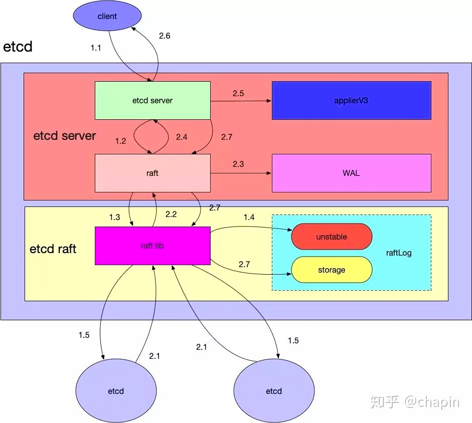
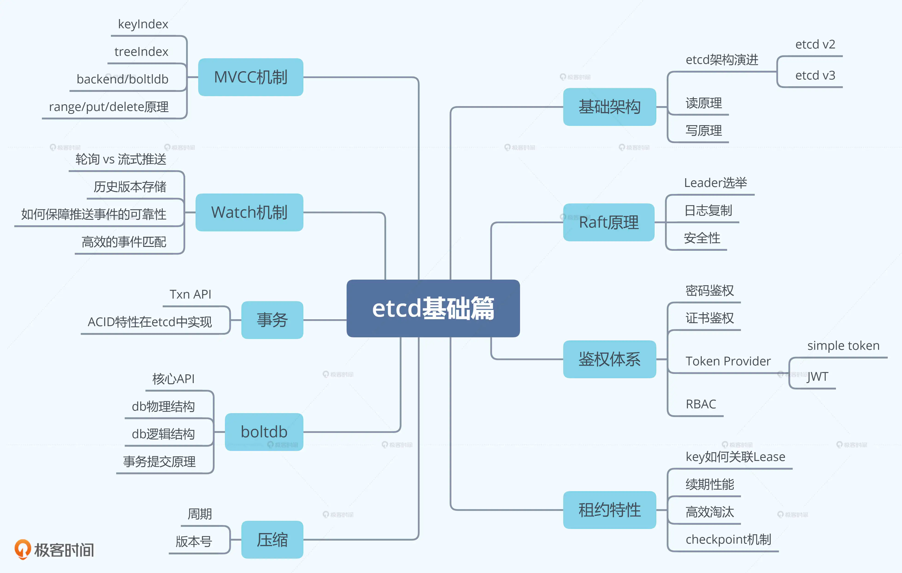
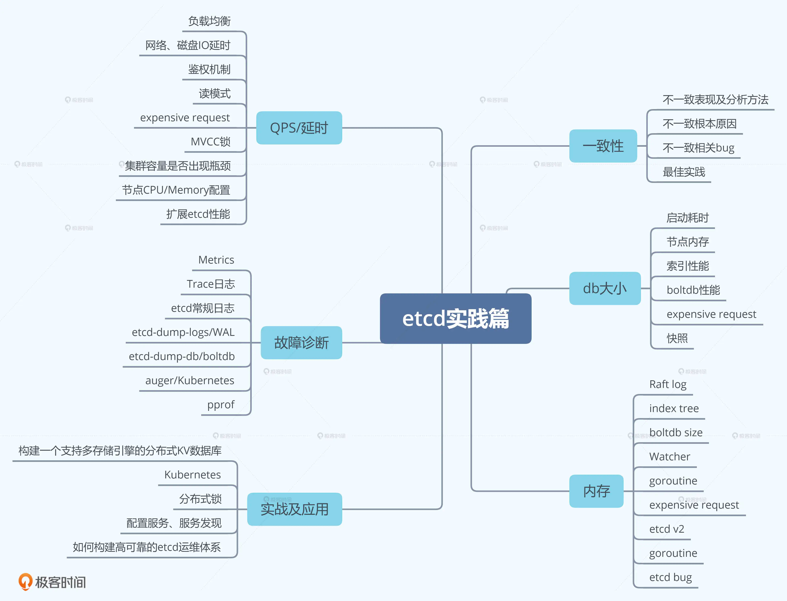
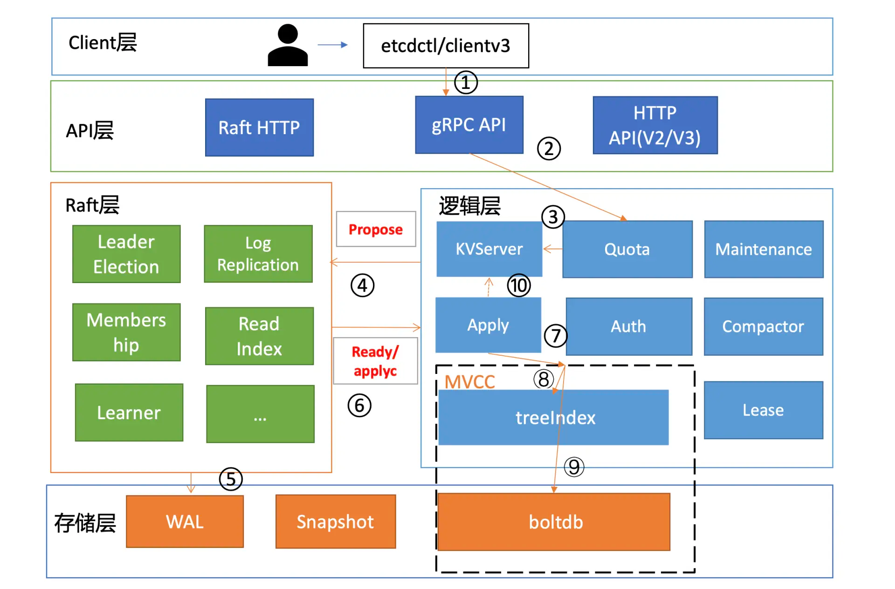

### 学习源码目标

1、首先，你能知道什么是 etcd，了解它的基本读写原理、核心特性和能解决什么问题。

2、然后，在使用 etcd 解决各类业务场景需求时，能独立判断 etcd 是否适合你的业务场景，并能设计出良好的存储结构，避免 expensive request。

3、其次，在使用 Kubernetes 的过程中，你能清晰地知道你的每个操作背后的 etcd 是如何工作的，并遵循 Kubernetes/etcd 最佳实践，让你的 Kubernetes 集群跑得更快更稳。

4、接着，在运维 etcd 集群的时候，你能知道 etcd 集群核心监控指标，了解常见的坑，制定良好的巡检、监控策略，及时发现、规避问题，避免事故的产生。 

5、最后，当你遇到 etcd 问题时，能自己分析为什么会出现这样的错误，并知道如何解决，甚至给社区提 PR 优化，做到知其然知其所以然。


### 基础模块篇 学习小目标

- etcd 基础架构。通过为你梳理 etcd 前世今生、分析 etcd 读写流程，帮助你建立起对 etcd 的整体认知，了解一个分布式存储系统的基本模型、设计思想。
- Raft 算法。通过为你介绍 Raft 算法在 etcd 中是如何工作的，帮助你了解 etcd 高可用、高可靠背后的核心原理。
- auth 鉴权模块。通过介绍 etcd 的鉴权、授权体系，带你了解 etcd 是如何保护你的数据安全，以及各个鉴权机制的优缺点。
- lease 租约模块。介绍 etcd 租约特性的实现，帮助你搞懂如何检测一个进程的存活性，为什么它可以用于 Leader 选举中。
- MVCC/Watch 模块。通过这两个模块帮助你搞懂 Kubernetes 控制器编程模型背后的原理。

#### 基础篇思维导图



### 实践篇 学习小目标

- 问题篇。为你分析 etcd 使用过程中的各类典型问题，和你细聊各种异常现象背后的原理、最佳实践。
- 性能优化篇。通过读写链路的分析，为你梳理可能影响 etcd 性能的每一个瓶颈。
- 实战篇。带你从 0 到 1 亲手参与构建一个简易的分布式 KV 数据库，进一步提升你对分布式存储系统的认知。
- Kubernetes 实践篇。为你分析 etcd 在 Kubernetes 中的应用，让你对 Kubernetes 原理有更深层次的理解。
- etcd 应用篇。介绍 etcd 在分布式锁、配置系统、服务发现场景中的应用。

#### 实践篇思维导图



### 本地部署集群

[官方文档](https://etcd.io/docs/v3.5/dev-guide/local_cluster/)

**开启窗口**

> 安装goreman管理协程
- 安装到gopath/bin/下。

`go get github.com/mattn/goreman`

- 启动goreman
> 会读取当前目录下的procfile配置文件并执行里面的配置命令
`goreman start`

**开启新窗口**

- 向集群添加leaner
`etcdctl member add infra4 --peer-urls="http://127.0.0.1:42380" --learner=true`

- 启动leaner
> 读取当前目录下的procfile.leaner配置文件

`goreman -f ./Procfile.learner start`

**开启新窗口**

- [按顺序执行官方文档的case](https://etcd.io/docs/v3.5/demo/)

### 源码目录解释：

> 核心包

- main.go etcd启动入口文件
- api - 定义网络访问client的通信协议内容：使用grpc，支持pb定义协议内容。比如编写proto文件的service kv和生成go文件的kvclient和kvserver等。
- client - 用于网络请求，使用api定义的协议格式，通过client完成对etcd服务器的访问。

- etcdctl - 访问etcd的命令行客户端工具。**有main入口，会独立编译成可执行文件**。实现了各种命令行函数的解析，最终会调用到etcd服务器里。参考.etcdctl下的doc.go和readme.md

- etcdutl - 管理etcd的命令行工具，直接访问etcd数据。**有main入口，会独立编译成可执行文件**，参考.etcdutl下的doc.go和readme.md

- pkg - etcd使用的各种实用业务不相关包，**轻量级**，业务不相关，不依赖其他包，比如crc的、flags的、http的、io的等。
- raft - raft一致性协议的实现代码，不包含etcd自己的代码。

- server - etcd服务器的主要实现代码
    * main.go - etcd服务入口文件，调用etcdmain.Main完成初始化和服务启动。
    * config - server配置操作包
    * auth - 权限认证
    * datadir - 数据存储目录
    * embed - 为将etcd嵌入到别的项目中而提供的功能
    * etcdmain - server启动程序，由main.go调用Main()实现。
    * etcdserver - server主要提供功能实现
    * mvcc - 多版本并发控制，保存历史数据和事务控制
    * proxy - 实现client访问server的代理功能，tcpproxy4层协议等
    * verify - 检查状态数据是否一致
    * wal - wal功能的实现


> 其他包

- contrib - 源码贡献用户
- tests - 单元测试目录
- tools - 数据批处理工具
- scripts - etcd的编译部署的脚本工具
- hack - 开发人员用到的工具，压测等
- logos - logo资源目录
- security - etcd的安全说明


### 配置文件参数解读

#### Member
- listen-client-urls：集群中每个节点监听的，**可让client**访问的url地址。表示的是可让别人访问的，但别人未必知道。
- listen-peer-urls：集群中每个节点监听的，**可让其他节点成员**访问的url地址。表示的是可让别人访问的，但别人未必知道。

#### cluster
- initial-advertise-peer-urls：每个节点保存的可访问到集群中其他全部节点的url地址。表示的是可访问这些url的任何一个来遍历整个集群成员。
- advertise-client-urls：每个节点保存的可公开给client访问的所有url地址。表示的是可访问这些url的任何一个来让外部client访问。


### 主要数据结构解释

- raft结构体
```go
// 保存服务器分布式状态的主结构体
type raft struct {
	id uint64  // raft节点id
	Term uint64  // 集群leader任期
	Vote uint64  // 当前候选人的id
	readStates []ReadState
	// the log
	raftLog *raftLog
	maxMsgSize         uint64  // 接受消息最大字节数
	maxUncommittedSize uint64  // 未提交消息最大字节数
	// TODO(tbg): rename to trk.
	prs tracker.ProgressTracker
	state StateType
	// isLearner is true if the local raft node is a learner.
	isLearner bool  // 是否是学习备用节点（学习节点无选举权限，作为备用节点，但会一直接受日志数据同步，直到追上leader后才能加入选举队伍中）
	msgs []pb.Message  //
	// the leader id
	lead uint64 // 当前leader id
	// leadTransferee is id of the leader transfer target when its value is not zero.
	// Follow the procedure defined in raft thesis 3.10.
	leadTransferee uint64
	// Only one conf change may be pending (in the log, but not yet
	// applied) at a time. This is enforced via pendingConfIndex, which
	// is set to a value >= the log index of the latest pending
	// configuration change (if any). Config changes are only allowed to
	// be proposed if the leader's applied index is greater than this
	// value.
	pendingConfIndex uint64
	// an estimate of the size of the uncommitted tail of the Raft log. Used to
	// prevent unbounded log growth. Only maintained by the leader. Reset on
	// term changes.
	uncommittedSize uint64

	readOnly *readOnly

	// number of ticks since it reached last electionTimeout when it is leader
	// or candidate.
	// number of ticks since it reached last electionTimeout or received a
	// valid message from current leader when it is a follower.
	electionElapsed int

	// number of ticks since it reached last heartbeatTimeout.
	// only leader keeps heartbeatElapsed.
	heartbeatElapsed int

	checkQuorum bool
	preVote     bool

	heartbeatTimeout int
	electionTimeout  int
	// randomizedElectionTimeout is a random number between
	// [electiontimeout, 2 * electiontimeout - 1]. It gets reset
	// when raft changes its state to follower or candidate.
	randomizedElectionTimeout int
	disableProposalForwarding bool

	tick func()
	step stepFunc

	logger Logger

	// pendingReadIndexMessages is used to store messages of type MsgReadIndex
	// that can't be answered as new lleader didn't committed any log in
	// current term. Those will be handled as fast as first log is committed in
	// current term.
	pendingReadIndexMessages []pb.Message
}
```
```go

// 服务器当前状态
type HardState struct {
	Term   uint64 `protobuf:"varint,1,opt,name=term" json:"term"`  // 服务器最后一次已知的任期号
	Vote   uint64 `protobuf:"varint,2,opt,name=vote" json:"vote"`  // 获得票选的候选人的id
	Commit uint64 `protobuf:"varint,3,opt,name=commit" json:"commit"`  // 已知最大的已提交的索引值
}
```

- kv存储结构体
```go

// 存储数据的map结构体
type KeyValue struct {
	// map的键名  key is the key in bytes. An empty key is not allowed.
	Key []byte `protobuf:"bytes,1,opt,name=key,proto3" json:"key,omitempty"`
	// 创建该key的版本号   create_revision is the revision of last creation on this key.
	CreateRevision int64 `protobuf:"varint,2,opt,name=create_revision,json=createRevision,proto3" json:"create_revision,omitempty"`
	// 修改该key的版本号  mod_revision is the revision of last modification on this key.
	ModRevision int64 `protobuf:"varint,3,opt,name=mod_revision,json=modRevision,proto3" json:"mod_revision,omitempty"`
	// 只表示该kv的修改次数  increases its version.
	Version int64 `protobuf:"varint,4,opt,name=version,proto3" json:"version,omitempty"`
	// map的键值  value is the value held by the key, in bytes.
	Value []byte `protobuf:"bytes,5,opt,name=value,proto3" json:"value,omitempty"`
	// key的租约，过期时间  If lease is 0, then no lease is attached to the key.
	Lease                int64    `protobuf:"varint,6,opt,name=lease,proto3" json:"lease,omitempty"`
	XXX_NoUnkeyedLiteral struct{} `json:"-"`
	XXX_unrecognized     []byte   `json:"-"`
	XXX_sizecache        int32    `json:"-"`
}
```

- raft节点实现结构体
```go

// node is the canonical implementation of the Node interface
type node struct {
    propc      chan msgWithResult  // 此管道用于在stepWithWaitOption中，接受和传递命令消息，并且携带处理错误信息
    recvc      chan pb.Message  // 用于接受和传递节点之间选举信息
    confc      chan pb.ConfChangeV2 // 用于接受和传递节点之间的配置信息
    confstatec chan pb.ConfState  // 用于接受和传递节点之间的状态信息
    readyc     chan Ready  // 用于接受和传递准备好的待处理数据，比如新数据和重启后待处理的数据。获取要处理的数据前，会先看advancec如果没值，才会把ready写入readyc。
    advancec   chan struct{}  // 用于接受和传递预备管道的数据，advancec赋值后就要清空readyc管道，以准备继续接受下一个。
    tickc      chan struct{}  // 计数时钟，到期后发起选举
    done       chan struct{}  //
    stop       chan struct{} //
    status     chan chan Status //
    
    rn *RawNode
}

```


### 主要服务启动流程

- etcdserver/server.go/NewServer() 新建etcdserver，调用startNode()启动raft节点，然后初始化applier、mvcc等
- etcserver/raft.go/startNode() 启动raft节点，有peers参数不为空则启动raft，否则是重启
- raft/node.go/RestartNode()和StartNode() 新建节点，调用run()启动raft服务
- raft/node.go/run() 由节点step()接收然后处理过的提案消息，然后发送到propc等管道，run()监听这些管道，检查后交给raft.go/step()处理。


- 启动raft节点服务
```go
// 使用传入的集群和节点列表配置信息启动节点。
func StartNode(c *Config, peers []Peer) Node {
	// ...
	rn, err := NewRawNode(c)
	// ...
	n := newNode(rn)

	go n.run()
	return &n
}
```

启动节点调用run开始监听接收提案
```go
func (n *node) run() {
	var propc chan msgWithResult
	// ... 
	for {
		// ...
		select {
		// 读取提案，然后交给raft的step去处理
		case pm := <-propc:
			m := pm.m
			m.From = r.id
			err := r.Step(m)  // 如果当前节点是leader，调用raft的stepleader，如果是follower，调用raft的stepfollower，。。。
			if pm.result != nil {
				pm.result <- err
				close(pm.result)
			}
		// ...	
		}
		// ...
	}
}
```


### etcdserver执行put key value的流程


#### 一、流程分析

1、client层发起"put k1 v1"的请求命令，通过负载均衡算法找到一台etcd节点，发起grpc调用。

2、etcd节点收到请求后，经过grpc拦截器，进入quoa配额检查模块。

3、接着请求传递给kvserver模块，检查数据大小、限流等，然后命令打包成提案消息，提交给raft服务模块。

4、raft服务模块接收到提案，如果节点是非leader，会把写请求的提案通过channel通知到etcdserver，然后转发给leader处理。leader接收到该消息，会广播给其他节点。

5、广播到的节点，要把集群 Leader 任期号、投票信息、已提交索引、提案内容持久化到一个 WAL（Write Ahead Log）日志文件，以保证集群节点间一致性。
  当一半以上节点持计划此日志后，raft模块就会通过channel通知etcdserver服务模块，put提案已被多数节点确认，状态为已提交。

6、已提交的提案组织成Ready结构体，写入applyc管道，etcdserver服务监听读取applyc，apply模块依次读取applyc，然后准备执行。

7、apply模块依次取出消息，检查到未执行的提案。

8、apply将未执行的提案传递给mvcc模块，mvcc模块使用内存索引模块treeindex，保存key的历史版本信息。

9、apply写入treeindex成功后，将提案内容发给存储层的boltdb，持久化key-value数据。


#### 二、数据流向细节

1、调用etcdserver入口的put方法

2、执行回调函数putCommandFunc

3、调用client/v3/kv.go的Do进行协议解析

4、解析成kvclient的put命令发送给EtcdServer

5、【A】etcdserver使用raft.go初始化的raftkv，去调用raft模块。同时会调用start启动监听Ready和Advance数据。

6、【B】node节点调用run()方法，启动监听各个数据管道。

6、将数据发送到raft模块的node节点，并执行propose方法。

7、propose将数据发送到propc管道。

8、node监听到数据，并将数据通过Step投放到leader或follower，默认是stepFollower。如果是follower，会转发到leader上去执行。

9、node限制的命令管道长度1024个

10、【B】读取HasReady()检查有准备好的数据。

11、通过readyWithoutAccept()将数据读到Ready结构体，并生成一个readyc。

12、将Ready数据写入readyc。

13、然后调用accept改变Ready状态，并生成一个advancec管道。

14、【A】etcdserver检测到advancec不为nil，空结构体写入advancec通知管道可消费。

15、【B】最终调用raft/raft.go的advance()将数据根据r.raftLog.lastIndex()索引位置，组织成softstate结构体，
    然后存储到unstable的raftlog日志中。

16、【B】将Ready结构体，通过send()写入到raft.msgs数组里

17、【A】监听到Ready()数据，通过r.transport.Send()，再取peer.send()，发送给其他etcd节点。【softstate是可变值。hardstate是wal文件对象】 。等其他raft节点保存并返回。

18、【A】peer启动时会监听接收消息p.recvc。其他节点收到该消息时会将recvc := cr.recvc传递给p.recvc，然后peer调用
17、【A】etcdserver监听到数据已写完，raft.go将数据记录到wal中，然后写入etdserver的applierv3内存中。然后再次通知raft模块该持久化存储数据了。
    同时会给客户端成功响应。

18、【B】raft模块接收到存储命令，将数据按索引unstable日志中取出并存到持久化的raftlog中。


### 分析put key value执行代码

1、先启动etcdserver监听来自client的命令

2、etcdctl在./v3/ctl.go里注册put命令，并调用etcserver里的put方法。

注册命令

```go
// 注册命令，./v3/ctl.go
rootCmd.AddCommand(
	command.NewPutCommand()
)

// 绑定命令回调函数，./ctv3/command/put_command里完成put命令绑定
cmd := &cobra.Command{
    Use:   "put [options] <key> <value> (<value> can also be given from stdin)",
    Short: "Puts the given key into the store",
    Long: "",
    Run: putCommandFunc,
}
```

注册grpc-client

```go
// RetryKVClient 注册grpc-client
func RetryKVClient(c *Client) pb.KVClient {
    return &retryKVClient{
    	kc: pb.NewKVClient(c.conn),
    }
}
```

执行put命令回调函数，etcdctl/ctlv3/command/put_command.go

```go
func putCommandFunc(cmd *cobra.Command, args []string) {
    key, value, opts := getPutOp(args)

    ctx, cancel := commandCtx(cmd)
    resp, err := mustClientFromCmd(cmd).Put(ctx, key, value, opts...)  // 获取执行该命令的client对象。
    cancel()
    // ...
    display.Put(*resp)
}

// mustClientFromCmd() 获取client对象，该对象结构体如下。封装组合了几种常用功能。
type Client struct {
  Cluster  
  KV   // 存储相关的命令，put range get等
  Lease  // 租约相关的命令
  Watcher  // 监听相关的命令
  Auth  // 授权相关的
  Maintenance
  // ...
}

// 回调函数调用client/v3/kv.go里的put函数。
func (kv *kv) Put(ctx context.Context, key, val string, opts ...OpOption) (*PutResponse, error) {
    r, err := kv.Do(ctx, OpPut(key, val, opts...))
    return r.put, toErr(ctx, err)
}
```

调用Do处理具体命令的执行

```go
// client/v3/kv.go。
// 使用/api/etcdserverpb/rpc.pb.go里定义好的协议格式
func (kv *kv) Do(ctx context.Context, op Op) (OpResponse, error) {
    var err error
    switch op.t {
    case tPut:
        var resp *pb.PutResponse
        r := &pb.PutRequest{Key: op.key, Value: op.val, Lease: int64(op.leaseID), PrevKv: op.prevKV, IgnoreValue: op.ignoreValue, IgnoreLease: op.ignoreLease}
        resp, err = kv.remote.Put(ctx, r, kv.callOpts...)
        if err == nil {
        return OpResponse{put: (*PutResponse)(resp)}, nil
}
```


调用自动生成的kvclient的put命令，发送到etcdserver进行处理

```go
// Put
func (c *kVClient) Put(ctx context.Context, in *PutRequest, opts ...grpc.CallOption) (*PutResponse, error) {
    out := new(PutResponse)
    err := c.cc.Invoke(ctx, "/etcdserverpb.KV/Put", in, out, opts...)  // invoke调用kvserver下的put方法
    if err != nil {
        return nil, err
    }
    return out, nil
}
    
// /api/etcdserverpb/rpc.proto里的put方法
rpc Put(PutRequest) returns (PutResponse) {
    option (google.api.http) = {
        post: "/v3/kv/put"
        body: "*"
    };
}
```

3、服务器执行

首先服务器启动时注册并绑定了kvserver，并且使用raft.go初始化raftkv结构体，以调用raft模块。

```go
// EtcdServer /server/etcdserver/server.go etcdserver结构体
type EtcdServer struct {
}
        
// 在server/api/v3rpc/grpc.go里进行kvserver注册
func Server(s *etcdserver.EtcdServer, tls *tls.Config, gopts ...grpc.ServerOption) *grpc.Server {
  	
	// ...
	
    pb.RegisterKVServer(grpcServer, NewQuotaKVServer(s))  // 注册kv操作的grpc-server端，quota是组合的增强版
    pb.RegisterWatchServer(grpcServer, NewWatchServer(s))
    pb.RegisterLeaseServer(grpcServer, NewQuotaLeaseServer(s))
    pb.RegisterClusterServer(grpcServer, NewClusterServer(s))
    pb.RegisterAuthServer(grpcServer, NewAuthServer(s))
    pb.RegisterMaintenanceServer(grpcServer, NewMaintenanceServer(s))

    // ...
    
    return grpcServer
}

// NewQuotaKVServer 创建kvserver，比NewKVServer()多了超出阈值的警告逻辑
func NewQuotaKVServer(s *etcdserver.EtcdServer) pb.KVServer {
    return &quotaKVServer{
        NewKVServer(s),  // 调用NewKVServer创建pb.Kvserver
        quotaAlarmer{etcdserver.NewBackendQuota(s, "kv"), s, s.ID()},  // 阈值警告逻辑
    }
}
        
// NewKVServer 创建pb.kvserver，通过grpc调用时，直接使用的就是kvServer.put。
func NewKVServer(s *etcdserver.EtcdServer) pb.KVServer {
    return &kvServer{hdr: newHeader(s), kv: s, maxTxnOps: s.Cfg.MaxTxnOps}  // 用etcdserver.EtcdServer的实例s赋值给etcdserver.RaftKV
}

// kvserver /server/etcdserver/api/v3rpc/key.go 相关结构如下
type kvServer struct {
    hdr header
    kv  etcdserver.RaftKV
    // maxTxnOps is the max operations per txn.
    // e.g suppose maxTxnOps = 128.
    // Txn.Success can have at most 128 operations,
    // and Txn.Failure can have at most 128 operations.
    maxTxnOps uint
}
// RaftKV 提供增删改查以及事务相关的操作 /server/etcdserver/v3_server.go        
type RaftKV interface {
    Range(ctx context.Context, r *pb.RangeRequest) (*pb.RangeResponse, error)
    Put(ctx context.Context, r *pb.PutRequest) (*pb.PutResponse, error)
    DeleteRange(ctx context.Context, r *pb.DeleteRangeRequest) (*pb.DeleteRangeResponse, error)
    Txn(ctx context.Context, r *pb.TxnRequest) (*pb.TxnResponse, error)
    Compact(ctx context.Context, r *pb.CompactionRequest) (*pb.CompactionResponse, error)
}        
```


执行到key.kvserver里的put方法，再用raftkv调用etcdserver.put

```go
// Put 远程调用到server端的put方法
func (s *kvServer) Put(ctx context.Context, r *pb.PutRequest) (*pb.PutResponse, error) {
    if err := checkPutRequest(r); err != nil {
        return nil, err
    }
    
    resp, err := s.kv.Put(ctx, r)  // 调用到raftkv的put方法，实际是指向了EtcdServer.Put
    if err != nil {
        return nil, togRPCError(err)
    }
    
    s.hdr.fill(resp.Header)
    return resp, nil
}

// v3_server下定义EtcdServer.Put方法
// Put /server/etcdserver/v3_server.go
func (s *EtcdServer) Put(ctx context.Context, r *pb.PutRequest) (*pb.PutResponse, error) {
  ctx = context.WithValue(ctx, traceutil.StartTimeKey, time.Now())
  resp, err := s.raftRequest(ctx, pb.InternalRaftRequest{Put: r})  // 数据编码，然后访问操作raft模块
  if err != nil {
    return nil, err
  }
  return resp.(*pb.PutResponse), nil
}
```

4、访问raft状态机进行状态转移

由上面将数据发送到node.go节点

```go
// 调用server.raftNode结构体，该结构体是raft模块的node对象做实例化的。执行raft模块的propose方法。
// Propose node对象封装的准备调用对象，会将消息推送到propc中。
func (n *node) Propose(ctx context.Context, data []byte) error {
    return n.stepWait(ctx, pb.Message{Type: pb.MsgProp, Entries: []pb.Entry{{Data: data}}})
}
type node struct {
    propc      chan msgWithResult
    recvc      chan pb.Message
    //...
}
```

将请求数据发送到propc管道

```go
func (n *node) stepWithWaitOption(ctx context.Context, m pb.Message, wait bool) error {
    //... 
	
    ch := n.propc
    pm := msgWithResult{m: m}
    if wait {
        pm.result = make(chan error, 1)
    }
    select {
    case ch <- pm:
    if !wait {
        return nil
    }

// ...
}
```    

raft模块启动时监听并读取管道请求

```go
// run /raft/node.go 
func (n *node) run() {
	// ...
    for {
        // ...
        propc = n.propc
        //...
        select {
        // TODO: maybe buffer the config propose if there exists one (the way
        // described in raft dissertation)
        // Currently it is dropped in Step silently.
        case pm := <-propc:
        m := pm.m
        err := r.Step(m)  // 进入计划执行步骤
    }
}

// 检查是leader或follower，每种角色绑定了不同stepFunc函数。
// Step /raft/raft.go
func (r *raft) Step(m pb.Message) error {
    // Handle the message term, which may result in our stepping down to a follower.
        // ...
    switch m.Type {
    // ...
    default:
        err := r.step(r, m)
        if err != nil {
            return err
        }
    }
    
    return nil
}
```

默认每个节点设为follower，然后产生tickc去选举，变成candidate，选举成功变成leader，否则还是follower。
每种状态都会设置不同的step方法。stepCandidate、stepLeader或stepFollower。
去执行对应的step方法。

```go
// becomeFollower 设置stepFunc绑定函数 /raft/raft.go
func (r *raft) becomeFollower(term uint64, lead uint64) {
    r.step = stepFollower  // 绑定调用函数
    r.reset(term)
    r.tick = r.tickElection
    r.lead = lead
    r.state = StateFollower
    r.logger.Infof("%x became follower at term %d", r.id, r.Term)
}

// 将消息加入到raft的msgs中
func stepFollower(r *raft, m pb.Message) error {
    switch m.Type {
        case pb.MsgProp:
        	// ...
            m.To = r.lead
            r.send(m)
    }
    // ...
}
```

5、如果当前状态是leader，直接将日志条目保存到本地缓存；follower会将消息保存到本地的msgs数组里。
后续还是在node协程中，newReady()创建一个ready消息，将待持久化的日志条目或待发送的msgs封起来，然后发送到readyc管道里。

6、etcdserver启动的raftNode协程里，继续读取readyc的消息。send要转发的数据，保存要持久化的日志条目或快照数据，通知客户端完成请求。
另外，会将已经同步好的日志封装到apply消息里推送到applyc队列中，将数据保存到kv存储；同时通知状态机更新状态。


### raft的node文件里Node接口要实现的文件
- Tick()  -- 通过累计计数的方式计算超时时间
- Campaign(ctx context.Context) error  --  心跳超时后选举，发起竞选
- Propose(ctx context.Context, data []byte) error
- ProposeConfChange(ctx context.Context, cc pb.ConfChangeI) error  -- 改变集群配置，如新增节点等
- Step(ctx context.Context, msg pb.Message) error
- Ready() <-chan Ready
- Advance()
- ApplyConfChange(cc pb.ConfChangeI) *pb.ConfState
- TransferLeadership(ctx context.Context, lead, transferee uint64)
- ReadIndex(ctx context.Context, rctx []byte) error
- Status() Status
- ReportUnreachable(id uint64)
- ReportSnapshot(id uint64, status SnapshotStatus)
- Stop()


### 心跳和选举
1、newRaftNode  -- 新建一个raft节点
```go
func newRaftNode(cfg raftNodeConfig) *raftNode {
	// ...
	r := &raftNode{
		lg:             cfg.lg,
		tickMu:         new(sync.Mutex),
		raftNodeConfig: cfg,
		// set up contention detectors for raft heartbeat message.
		// expect to send a heartbeat within 2 heartbeat intervals.
		td:         contention.NewTimeoutDetector(2 * cfg.heartbeat),
		readStateC: make(chan raft.ReadState, 1),
		msgSnapC:   make(chan raftpb.Message, maxInFlightMsgSnap),
		applyc:     make(chan apply),
		stopped:    make(chan struct{}),
		done:       make(chan struct{}),
	}
	// 设置节点心跳计数周期
	if r.heartbeat == 0 {  
		r.ticker = &time.Ticker{}
	} else {
		r.ticker = time.NewTicker(r.heartbeat)
	}
	return r
```

几个重要计数：

- randomizedElectionTimeout：随机化选举超时计数。每个节点设置的发起选举的随机超时时间，避免同时发起选举竞选。
- electionElapsed：选举过期计数。follower判断leader是否过期，如果该值>=随机化选举超时计数，认为leader已挂，自己发起选举竞选campaign。
- heatbeatElapsed: 心跳过期计数。该值>=心跳超时计数时，leader广播心跳消息给follower。
- heatbeatTimeout：心跳超时计数。心跳超时时间和tick时间的比值。写死的1。

2、start  // raft节点启动
```go
// etcdserver/raft.go
// start prepares and starts raftNode in a new goroutine. It is no longer safe
// to modify the fields after it has been started.
func (r *raftNode) start(rh *raftReadyHandler) {
    internalTimeout := time.Second
    
    go func () {
        defer r.onStop()
        islead := false  // 默认是从节点
        
        for {
            select {
            case <-r.ticker.C:  // 监听计数channel
                r.tick()  // 调用节点tick方法，会往tickc中写入一个空格结构体
            case rd := <-r.Ready():
            }
        }
    }
}
```

3、becomeLeader  // 节点设置为leader节点
```go
// raft/raft.go
func (r *raft) becomeLeader() {
	// TODO(xiangli) remove the panic when the raft implementation is stable
	if r.state == StateFollower {
		panic("invalid transition [follower -> leader]")
	}
	r.step = stepLeader  // 设置处理leader节点产生消息的函数
	r.reset(r.Term)
	r.tick = r.tickHeartbeat  // 设置心跳过期计数，该值会累加，然后心跳超时计数比较是否需要发送心跳消息广播。
	r.lead = r.id
	r.state = StateLeader  // 设置为leader状态
	// ...
}
```

4、

### 通过proxy执行流程

1、etcdserver接受到来自grpc的put请求，调用已实现的put函数
```go
func (p *kvProxy) Put(ctx context.Context, r *pb.PutRequest) (*pb.PutResponse, error) {
	p.cache.Invalidate(r.Key, nil)
	cacheKeys.Set(float64(p.cache.Size()))

	resp, err := p.kv.Do(ctx, PutRequestToOp(r))
	return (*pb.PutResponse)(resp.Put()), err
}

// kvproxy接受的命令数有限，默认2048个，所以要有计数
cacheKeys.Set(float64(p.cache.Size()))

// 
resp, err := p.kv.Do(ctx, PutRequestToOp(r))

```