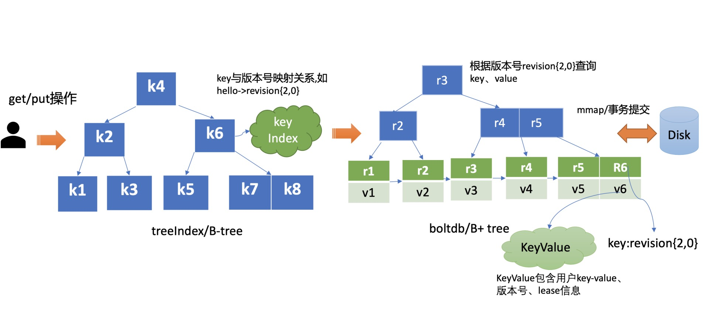
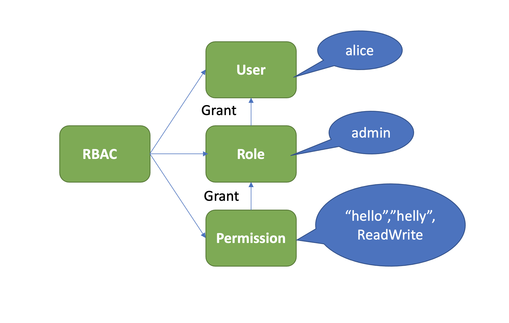

1、grpc的http2协议，etcd如何利用http2的多路复用、乱序发送、可靠传输的呢？

> https://time.geekbang.org/column/article/341060
>

2、etcd如何利用map和区间树来保存和查找key或key的范围，然后快速查找并找到watcher，然后推送key的修改事件的呢？

> https://time.geekbang.org/column/article/341060


3、选举时为什么要加入candidate？


4、raft所起的作用

- 
- 
- 

5、实现和使用raft的工具还有哪些？

- etcd
- es


6、etcd的串行读和线性读？怎么实现的？为什么从线性读的节点要一直阻塞等待applied index大于等于leader的committed index时才去读数据并返回呢？为什么不能直接从leader拿到最新数据直接返回给client呢？

> 串行读和线性读
- 串行读：直接读取状态机、无需通过raft协议与集群交互的方式。低延时、高吞吐，适合一致性不高的场景。
- 线性读：需要通过raft协议模块，反应的是集群共识，适合一致性高的场景。etcd默认是线性读。

> 线性读
- 串行读时，由于follower收到leader的数据应用日志条目是个异步过程，因此可能会读到旧数据。
- 增加readindex机制，收到查询请求时，先去请求leader，leader会把已提交索引（committed index）返回给follower节点。
- 在leader返回数据前，为防止脑裂，leader会先向集群follower发送心跳检测，一半以上确认后才返回索引。
- 读节点会一直等到applied index >= committed index时，才去通知读请求，可以去状态机访问数据了。
- 3.0中通过raft log read机制，先走一遍raft协议，会依赖磁盘io，性能比readindex差。


7、client、api和etcdserver的关系？client使用什么方式转发请求到etcdserver的？

> client 接受用户请求；负载均衡，通过api网络层将请求转发出给etcserver

> api网络层本身本身支持raft-http、grpc-api和http api（v2/v3)几种方式。
- raft-http指的的是server之间通过通过raft算法实现数据复制、leader选举等功能时使用的http协议。
- grpc-api支持http2，也可以通过grpc-gateway组件实现http1.x。

> client也可完成节点间故障自动转移，降低使用业务使用etcd复杂度，提升开发效率

8、etcd怎么存储key-value的？为什么不用一个key对应多个value的方式存储？

> kv存储
- wal和raft的内存模块都是日志条目存储的kv信息。
- key和index关联的结构是keyindex，通过b-tree树组织的。
- key-value和版本信息存储在boltdb的buffer和b+tree树里。

> key-value的对应关系
- 如果将一个key对应的所有value都存到一起，确实是方便了查询，但没法承受并发访问
- 通过将key映射成version，再将version绑定各个修改历史记录中，可以解决并发访问的问题

9、mvcc的核心思想是？怎么实现的？etcd怎么实现数据逻辑上的隔离的？

> 核心思想：保存一个key-value数据的多个历史版本。
- 通过mvcc，etcd实现了可靠的watch机制，避免client频繁发起list pod等expensive request等操作，保障集群稳定性。
- 同时，mvcc以较低的并发控制开销，实现各类隔离级别的事务，保障事务的安全性。

> 实现
- 通常的并发控制通过锁来实现，悲观锁保证同一时刻只能有一个事务对数据进行修改操作。
- mvcc是一种乐观锁。乐观的认为读写不会冲突，但一旦冲突有能力检测和解决冲突。
- mvcc多版本并发控制，通过存储数据的多个版本，来防止并发读写冲突。
- 每次更新或删除数据都会新增一条记录，新增的记录都有一个递增的版本号作为mvcc的逻辑时间。这样查询的时候是事务带着版本号去查询指定的快照数据的。


10、client如何做到故障自动转移

- 负载均衡
- 错误处理

11、etcd的raft怎么实现的，包含哪些模块？

实现的是一致性协议里的raft协议。
拆分成3个模块去实现。
- 共识模块 - 保证各个节点日志的一致性
- 日志模块 - 节点所有按执行顺序存放的日志
- 状态机 - 最终状态数据

12、etcd写入一条数据，哪些模块会涉及到数据存储？存储方式是什么？目的是什么

- raft 日志模块，内存存储，用于raft跟其他etcdserver通信做数据一致性检查使用。
- etcdserver wal，用于数据往boltdb同步、备份崩溃恢复。
- mvcc treeindex和boltdb。treeindex存储key的版本号，boltdb存储key-value的版本号、lease信息等。


13、treeindex和boltdb分别起什么作用？两者是怎么联系起来的？各自存储的结构长什么样子？

> treeindex和boltdb

- treeindex使用的是b-tree树，每个节点存储实际的keyindex数据，即key的各个版本号。
- boltdb分内存和磁盘两部分:buffer、b+tree。b+tree存储的是key-value，各种版本号、lease信息等。
- 先通过treeindex查到指定key的版本号，再拿版本号去boltdb里获取value信息。



14、全局版本号和事务内版本号区别？generation的存储什么信息？keyindex中各种版本号的区别，各自代表的意义是什么？

```go
type keyIndex struct {   
    key         []byte //用户的key名称，比如我们案例中的"hello"   
    modified    revision //最后一次修改key时的etcd版本号,比如我们案例中的刚写入hello为world1时的，版本号为2   
    generations []generation //generation保存了一个key若干代版本号信息，每代中包含对key的多次修改的版本号列表
}
```

- keyindex的结构体里面有个revision字段，又main和sub两个元素组成，main代表全局，sub代表本次事务内部版本号。
- etcd的全局版本号是全局单调递增的，空集群默认启动是1，随put/txn/delete从2开始递增，因此第一个key的全局版本号是2。而事务内部的是本次事务中put/delete所产生的版本号，从0开始增加。
- generation数组：每次创建一个key，生成第0代，以后每次修改只是往第0代里追加。直到删这个key，下次创建时会生成第1代。。。

```go
type generation struct {
   ver     int64    //表示此key的修改次数
   created revision //表示generation结构创建时的版本号
   revs    []revision //每次修改key时的revision追加到此数组
}
```


15、何为脑裂？如何解决？


16、watch机制如何实现？如何保障？

17、鉴权模块的作用是什么？如何实现多种权限机制和细粒度权限控制？鉴权的安全、性能以及一致性保障。


18、鉴权体系架构的控制面和数据面
> 控制面：调整认证、鉴权规则
- 流程：

- AuthServer收到请求，通过raft同步数据，apply通过鉴权存储模块AuthStore，将规则存储到boltdb的一系列鉴权表中


> 数据面
- 认证和授权
- 认证：密码认证和证书认证
- 密码认证通过后，会下发token
- token由TokenProvider负责，支持SimpleToken 和 JWT

> 密码认证安全性

密码破解手段：暴力枚举、字典、彩虹表等
- 安全性更高的hash算法，如sha-256
- 随机、较长的salt参数
- hash迭代多次

> 密码认证性能：Token Provider

- simple token：
    * 随机字符串；
    * 有状态的，带有ttl属性，存在server端，在 etcd v3.4.9 版本中，Token 默认有效期是 5 分钟；
    * 描述性太差；
    * 依赖server端每次都要检查token状态。
- jwt：Json Web Token
    * 三个对象组成：Header、Payload、Signature
    Header={"alg": "RS256"，"typ": "JWT"}
    Payload={"username": username，"revision": revision，"exp": time.Now().Add(t.ttl).Unix()，}
    Signature=RSA256(base64UrlEncode(header) + "." +base64UrlEncode(payload)，key)

    * JWT 就是由 base64UrlEncode(header).base64UrlEncode(payload).signature 组成

    * 自带可描述性

> 证书认证

证书认证在稳定性、性能上都优于密码认证。

> 授权

常用权限控制方法：
ACL(Access Control List)
ABAC(Attribute-based access control)
RBAC(Role-based access control)
etcd 实现的是 RBAC 机制。

> RBAC：角色权限控制
- User、Role、Permission

- 角色是权限赋予的对象
- 用户权限由角色控制

19、活性（liveness）检测方案

- 被动型检测：探测节点定时探测leader，如redis Sentinel
- 主动型上报：leader主动上报，超时未上报后，follower快速感知。

20、租约lease

> 原理
- 基于主动性上报模式，提供的一种活性检测机制
- client与etcdserver之间协商一个约定：在ttl有效期内，不会删除client关联到指定lease上的key-value。
- 未在ttl期间续约的，会删除lease和关联的key-value。

> 提供api
- grant 创建一个指定ttl的lease，并持久化存到boltdb中
- revoke 撤销一个lease，并删除相关联的数据
- leasetimetolive 获取一个lease的有效期、过期时间
- leasekeepalive 为指定lease续期

21、itemmap和itemset的作用？两个常驻协程的作用？

> itemmap
当创建完一个lease后，会存储到该内存结构体中。

> itemset
当put一个key，并指定lease时，会将该key关联到该lease的key内存集合itemset中

> 两个常驻协程？
- 一个是RevokeExpiredLease任务，定期检查过期lease，发起过期lease的撤销操作。leader会立刻将撤销租约的请求转发给follower。每隔500ms触发一次检查。
- 一个是CheckpointScheduledLease任务，定时触发更新lease的剩余到期时间的操作。每隔5分钟同步一次。

22、哪些lease操作需要leader处理？哪些需要操作需要经过raft log同步？
lease的数据在leader的内存里，因此：
- leasekeepalive（LeaseRenew）续期操作必须由leader处理。因为过期最小堆在leader内存里维护。
[查看源码](https://sourcegraph.com/github.com/etcd-io/etcd@54ba9589114fc3fa5cc36c313550b3c0c0938c91/-/blob/etcdserver/v3_server.go?L268)
    * 如果是follower接收，必须转发到leader上执行获取结果，然后将结果返回给客户端。
    (原文注释：// renewals don't go through raft; forward to leader manually)
    * 不经过raft协议处理，即其他节点不会执行。也就说是其他节点上的ttl可能不准确。但无所谓。
    * checkpoint会定期的将剩余ttl通过raft log同步给follower的。

- LeaseTimeToLive检索ttl操作，也是由leader处理。
[查看源码](https://sourcegraph.com/github.com/etcd-io/etcd@54ba9589114fc3fa5cc36c313550b3c0c0938c91/-/blob/etcdserver/v3_server.go?L301)
    * 如果是follower接收，必须转发到leader上去获取值，返回将信息返回给客户端。
    * 不经过raft协议处理，即其他节点不会执行。

- revoke撤销操作会经过raft协议同步，因此任意节点都可以处理该命令。
[查看源码](https://sourcegraph.com/github.com/etcd-io/etcd@54ba9589114fc3fa5cc36c313550b3c0c0938c91/-/blob/etcdserver/v3_server.go?L260)

- grant创建操作会经过raft协议同步，因此任意节点都可以处理该命令。
[查看源码](https://sourcegraph.com/github.com/etcd-io/etcd@54ba9589114fc3fa5cc36c313550b3c0c0938c91/-/blob/etcdserver/v3_server.go?L247)

23、如何高效检查淘汰过期的lease？

- Leader 节点按过期时间维护了一个最小堆，若你的节点异常未正常续期，那么随着时间消逝，对应的 Lease 则会过期，Lessor 主循环定时轮询过期的 Lease。获取到 ID 后，Leader 发起 revoke 操作，通知整个集群删除 Lease 和关联的数据。

- Lessor 模块会将已确认过期的 LeaseID，保存在一个名为 expiredC 的 channel 中，而 etcd server 的主循环会定期从 channel 中获取 LeaseID，发起 revoke 请求，通过 Raft Log 传递给 Follower 节点。

- 各个节点收到 revoke Lease 请求后，获取关联到此 Lease 上的 key 列表，从 boltdb 中删除 key，从 Lessor 的 Lease map 内存中删除此 Lease 对象，最后还需要从 boltdb 的 Lease bucket 中删除这个 Lease。

24、为什么需要checkpoint机制？

> 如果没有会发生什么？
- 当你的集群发生 Leader 切换后，新的 Leader 基于 Lease map 信息，按 Lease 过期时间构建一个最小堆时，etcd 早期版本为了优化性能，并未持久化存储 Lease 剩余 TTL 信息，因此重建的时候就会自动给所有 Lease 自动续期了。然而若较频繁出现 Leader 切换，切换时间小于 Lease 的 TTL，这会导致 Lease 永远无法删除，大量 key 堆积，db 大小超过配额等异常。

> 如何解决？
- 引入CheckPointScheduledLeases的任务
- 一方面，etcd 启动的时候，Leader 节点后台会运行此异步任务，定期批量地将 Lease 剩余的 TTL 基于 Raft Log 同步给 Follower 节点，Follower 节点收到 CheckPoint 请求后，更新内存数据结构 LeaseMap 的剩余 TTL 信息。
- 另一方面，当 Leader 节点收到 KeepAlive 请求的时候，它也会通过 checkpoint 机制把此 Lease 的剩余 TTL 重置，并同步给 Follower 节点，尽量确保续期后集群各个节点的 Lease 剩余 TTL 一致性。
- 最后你要注意的是，此特性对性能有一定影响，目前仍然是试验特性。你可以通过 experimental-enable-lease-checkpoint 参数开启。

25、给绑定到同一lease上的key续期，会影响其他key吗？

- 会，会同时将该lease的ttl更新掉，会影响其他key。
- 并不会将key与此lease解绑，再绑到新ttl对应的lease上。

26、是一个key一个lease吗？

由上层使用方决定，一般为了减轻同步负载，是一个ttl范围内的生成一个lease，让key都绑定到这一个lease上。

27、lease最小ttl为多少？
minTTL := time.Duration((3*cfg.ElectionTicks)/2) * heartbeat
heartbeat := time.Duration(cfg.TickMs) * time.Millisecond